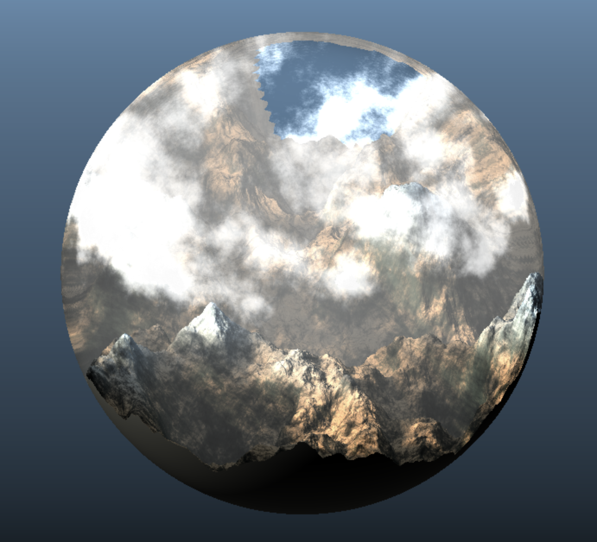

# Terrain Globe

## Overview

[Live Demo](https://www.wuwayne.com/hw02-landscape)

This project renders a terrain inside a globe usind SDFs and ray marching.
The globe is made with a simple sphere which acts as the bounding volume for the terrain, and will refract the ray as it is being marched.
Both the terrain and the animated cloud are made with FBM noises inspired by IQ's terrain tutorials. 
Soft shadows are added to the terrain with atmospheric fog based on distance from camera.

## Toolbox Functions

Toolbox functions that are used:

* Smoothstep: for blending between different terrain colors
* Bias: for controlling the intensity of the cloud
* Gain: for controlling the gradient of the background
